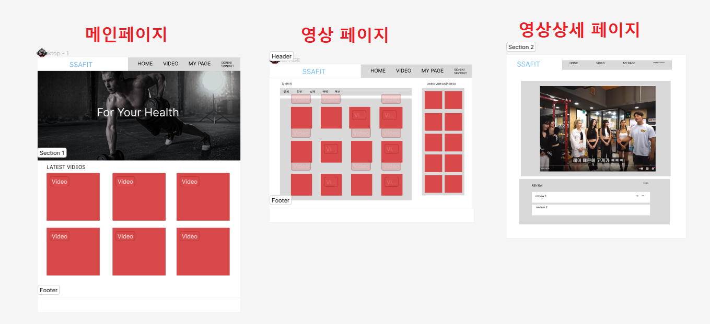
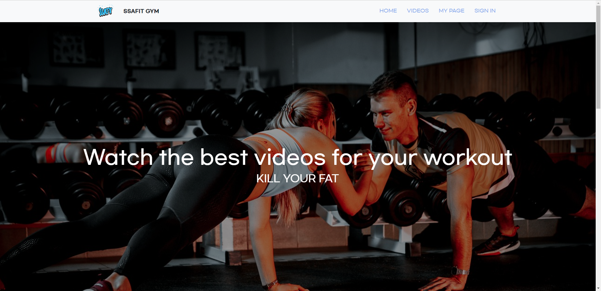
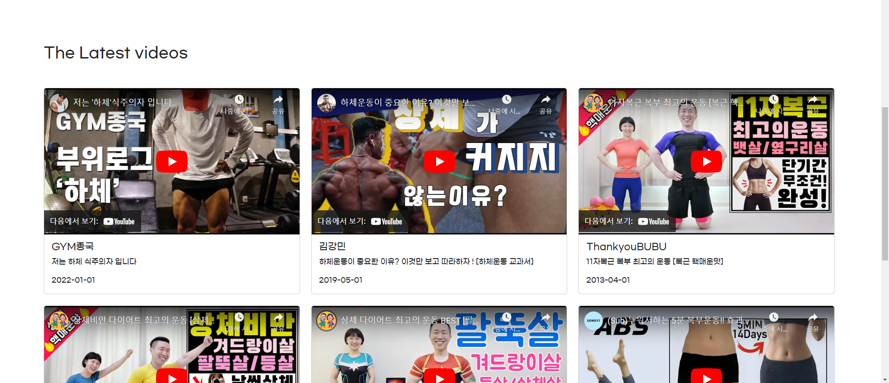
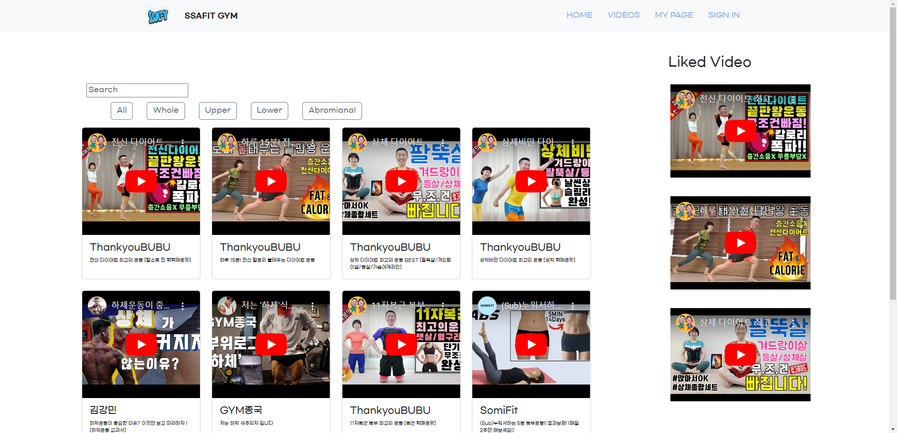
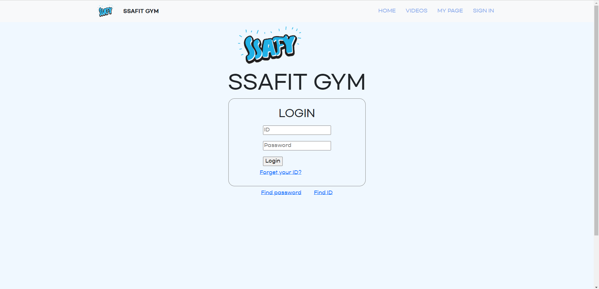
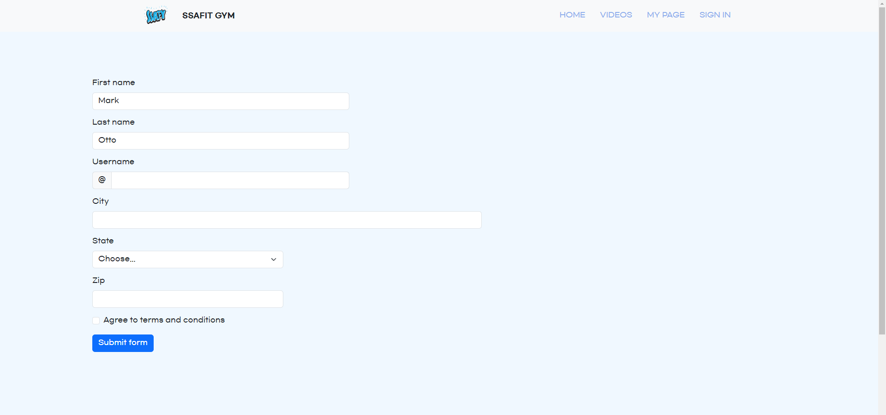

__✔ 작성 정보__

팀 : 서울 7반 A 조

팀장 : 조현수

팀원 : 석지명

날 짜 : 2023-08-11

개발도구 : VScode, BootStrap

협업 도구 : Github

<br>

✔ **프로젝트 요구사항**
1. 다양한 운동영상정보와 영상의 리뷰와 관련된 페이지를 제공한다.
2. 메인페이지에서 주어진 JSON데이터를 이용해 운동영상 정보의 다양한 화면을 구성한다.
3. 사이트의 주요 메뉴를 구성한다.
4. 운동영상에 대한 리뷰 등록, 삭제, 수정 등이 가능한 관리 페이지를 구성한다.


<br>

✔ **구상 및 설계**



0. 혼동을 피하기 위해 각 페이지 및 페이지에 대한 js, css파일을 따로 구성하고, 외부폰트와 BootStrap을 이용하여 페이지를 꾸며본다.

1. 메인페이지의 네비게이션 바를 통해 홈페이지, 영상목록 및 로그인 페이지에 접근할 수 있도록 한다.
    - 메인페이지에서는 최근 영상목록만을 시간 순서로 화면에 띄운다.

2. 영상목록에서는 영상의 제목을 클릭하여 영상상세 페이지에 접근할 수 있다.
    - 자신이 찜한 영상을 우측에 띄운다

3. 리뷰 관리페이지를 따로 만들지 않고 영상상세 페이지에서 리뷰 관리를 가능하도록 한다.

4. 로그인 페이지에서는 로그인이 가능하며, 회원가입 페이지로 이동가능하게 한다.

✔ **폴더 구조**

```
📂 assets
   ㄴ 📂 css
        ㄴ ☕ signin.css
        ㄴ ☕ signup.css
        ㄴ ☕ style.css
        ㄴ ☕ video.css
    
    ㄴ 📂 fonts
        ㄴ ☕ GmarketSansTTFBold.ttf
        ㄴ ☕ GmarketSansTTFLight.ttf
        ㄴ ☕ GmarketSansTTFMedium.ttf

    ㄴ 📂 image
        ㄴ ☕ favicon.svg
        ㄴ ☕ logo.png
        ㄴ ☕ logo2.png
        ㄴ ☕ main.jpg

📂 data
   ㄴ ☕ video.json

📂 detail
   ㄴ ☕ video_detail1.html

📂 js
   ㄴ ☕ detail.js
   ㄴ ☕ main.js
   ㄴ ☕ video.js


☕ main.html
☕ signin.html
☕ signup.html
☕ video.html

```


# 기본 기능 구현 화면

## 메인화면



메인페이지는 심플하게 구성하고, 네비게이션 바를 통해 영상목록, 로그인 페이지로 접근가능하다.
<br>
스크롤을 아래로 내리면


위와 같이 최근에 올라온 영상을 업로드 최신 순으로 볼 수 있다.
```js
//최신 순으로 비디오 가져오기
let newVideoList = videoList.sort((a, b) => new Date(b.date) - new Date(a.date));


//최신 날짜 video 6개 가져오기
for (let i = 0; i<6; i++){
    newVideoHtml += `
    <div class="col">
    <div class="card h-100">
      <iframe class="card-img-top" width="560" height="315" src="https://www.youtube.com/embed/${newVideoList[i].id}" title="YouTube video player" frameborder="0" allow="accelerometer; autoplay; clipboard-write; encrypted-media; gyroscope; picture-in-picture; web-share" allowfullscreen></iframe>
      <div class="card-body">
        <h5 class="card-title">${newVideoList[i].channelName}</h5>
        <p class="card-text">${newVideoList[i].title}</p>
        <p class="card-text">${newVideoList[i].date}</p>
      </div>
    </div>
    </div>
    `
}
```
---

## 영상목록 화면

영상목록 화면에서는 영상제목을 클릭하여 영상상세 페이지로 접근가능하다.
그리고, 우측 사이드바를 통하여 자신이 찜한 영상을 따로 모아둘 수 있다.

---

## 영상상세 화면

영상상세 화면에서는 자세한 영상을 확인할 수 있고,


## 영상상세 - 리뷰관리 화면

하단으로 쭉 내려 리뷰등록 등 리뷰를 관리할 수 있다.

---

## 로그인 화면

네비게이션 바의 로그인을 눌러 로그인 페이지로 접근할 수 있는데,
로그인 화면에서는 로그인이 가능하며, "forget your id?" 문구를 클릭하여 회원가입 페이지로 접근할 수 있다.

---

## 회원가입 화면


# 추후 구현할 것들
1. 영상 찜이 가능하도록 추가
3. 현재는 영상목록 페이지에서 단 하나로의 영상상세 페이지로만 접근이 가능한데, 각 영상에 맞는 상세페이지 접근이 가능하도록 기능 구현
2. 영상 리뷰에서 등록뿐만 아니라 수정, 삭제가 가능하도록 기능 추가
3. 로그인 로그아웃 기능 추가
4. 마이페이지 추가
5. 아이디 비밀번호 찾기 기능 추가