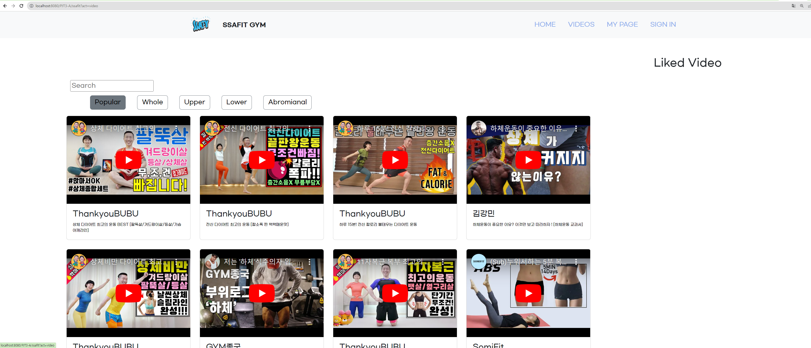

__✔ 작성 정보__

팀 : 서울 7반 A 조

팀장 : 석지명

팀원 : 이동혁

날 짜 : 2023-09-15

개발도구 : eclipse, BootStrap

협업 도구 : Github

 

---

✔ **프로젝트 요구사항**

📌 요구사항
✅ : 구현 완료,   🔼 : 부분 구현,   ❌ : 미구현

1️⃣ 기본기능
- 메인 페이지 백엔드 기능(VIDEO 페이지에 구현)
    - 조회수 기준 영상 ✅ 
    - 부위별 기준 영상 ✅ 
- 운동영상에 대한 리뷰관리 백엔드 기능 구현 ✅ 
- 리뷰 목록/등록/수정/상세/삭제 기능 구현 ✅ 

2️⃣ 추가기능
- 회원가입 백엔드 구현 ❌
- 로그인, 로그아웃 백엔드 구현 ❌

3️⃣ 심화기능
- 관심영상 찜하고 찜한영상 삭제 ❌
- 다른 회원을 팔로우할 수 있다. ❌

 

---

✔ **구상 및 설계**

0. 기존에 진행했던 프론트엔트 관통PJT 를 활용하여 백앤드 기능을 추가한다.

1. 메인페이지의 네비게이션 바를 통해 홈페이지, 영상목록 및 로그인 페이지에 접근할 수 있도록 한다.
    - 모든 페이지의 header를 header.jsp파일을 통해 구현하여 중복된 코드를 쓰지않아도 되도록 기능을 구현한다.
    - 영상목록 페이지에서 조회순, 부위별 영상을 따로 볼 수 있도록 백앤드 기능을 구현한다.

2. 영상목록에서는 영상의 제목을 클릭하여 영상상세 페이지에 접근할 수 있다.
    - 영상의 제목 클릭 시 백앤드 기능을 추가하여 영상마다 추가적인 페이지를 만들 필요없이, 영상의 정보를 받아와 영상 상세 페이지를 구성한다.

3. 리뷰 상세페이지를 따로 만들지 않고 영상상세 페이지에서 리뷰 관리를 가능하도록 한다.
    - 자바스크립트를 활용하고 백앤드 기능을 추가하여, 영상상세 페이지에서 리뷰의 CURD(등록, 조회, 수정, 삭제)가
    가능하도록 구현한다.

---

✔ **폴더 구조**

---

✔ **UML 클래스 다이어그램**

# 기본 기능 구현 화면

---

## 영상목록 화면

영상목록 페이지에서 popular 버튼을 누르면 조회순 기준으로 정렬된 영상이 나온다.
 

각 부위에 맞는 버튼을 누를 경우, 누른 부위 해당하는 영상이 나온다.

---
---

## 영상상세 화면

영상상세 화면에서는 누른 영상 정보에 맞는 영상 페이지로 들어가게 되고,

## 영상상세 - 리뷰관리 화면

하단으로 쭉 내려 영상에 맞는 리뷰목록을 볼 수 있고, 리뷰등록/수정/삭제 리뷰를 관리할 수 있다.

---

### 리뷰 등록 

---

### 리뷰 수정

### 리뷰 삭제 

# 추후 구현할 것들
1. 메인페이지에서 최신영상을 불러올 때, 데이터베이스에서 날짜 순으로 불러오도록 백앤드 기능 구현
2. 리뷰 삭제 시 자바스크립트 confirm을 이용해 정말로 삭제할 건지 물어보는 기능 추가
3. 회원가입/로그인/로그아웃 백앤드 구현
4. 마이페이지 구현
5. 아이디 비밀번호 찾기 백앤드 기능 추가
6. 회원의 팔로우 정보 관리 백앤드 구현
7. 회원의 찜 관리 백앤드 구현
8. 영상목록 페이지에서 종류에 맞는 버튼을 눌렀을 때, 누른 상태의 색깔이 고정되도록 HTML코드 수정