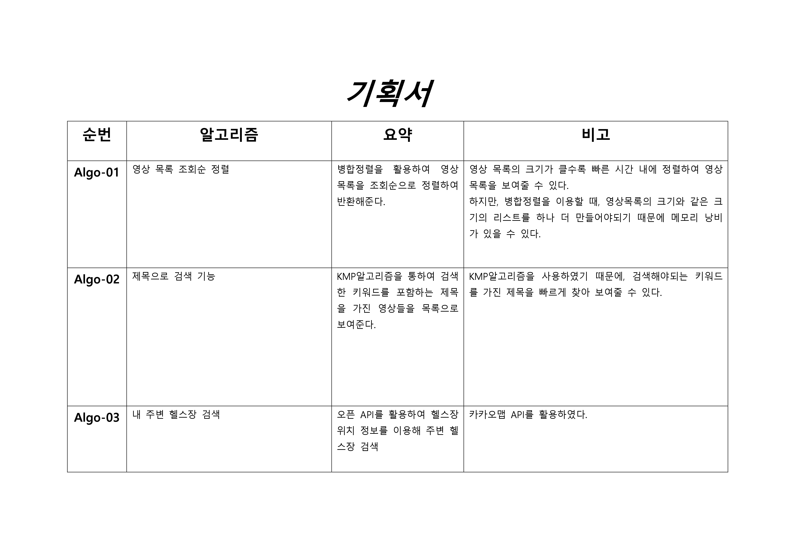
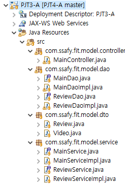
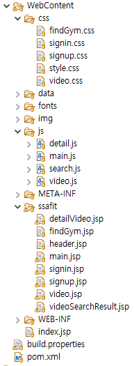
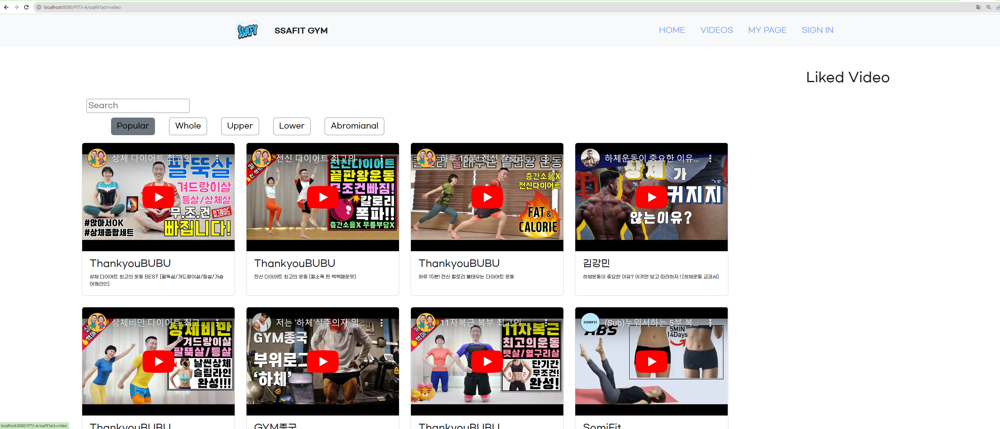
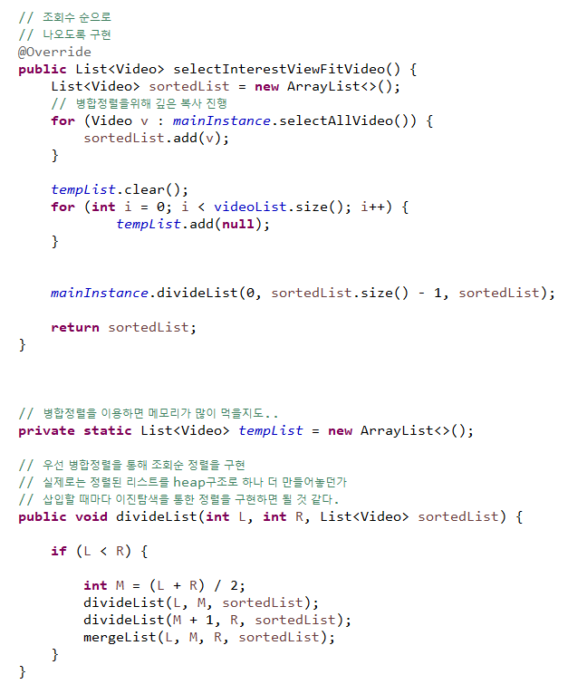
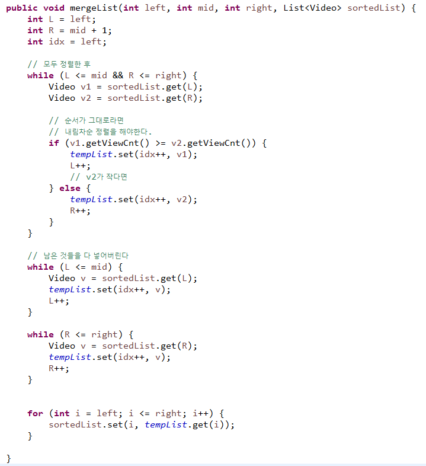
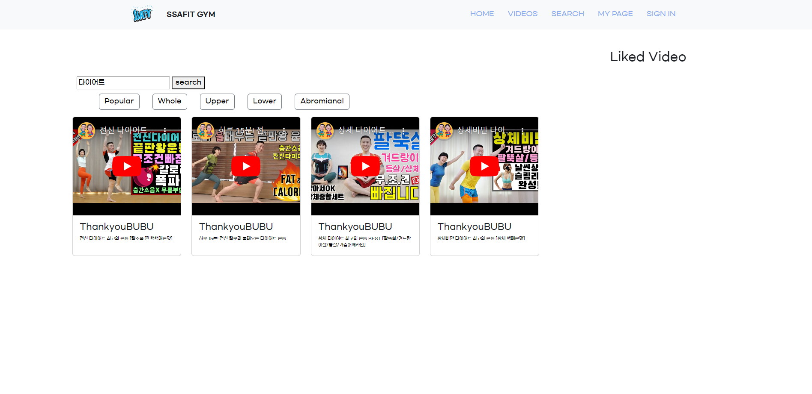
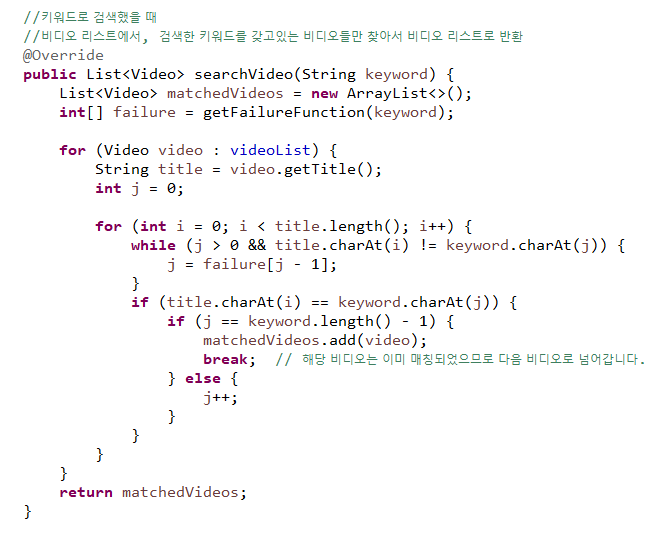
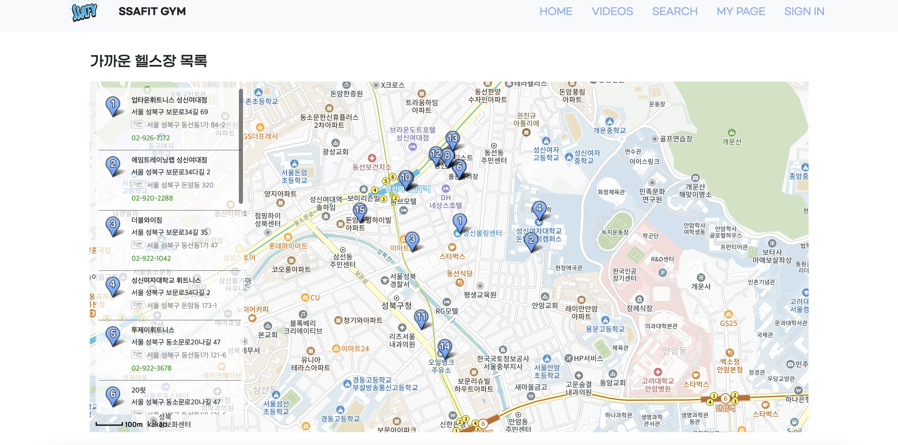

**✔ 작성 정보**

팀 : 서울 7반 A 조

팀장 : 석지명

팀원 : 김예림 이동혁

날 짜 : 2023-10-06

개발도구 : eclipse

협업 도구 : Github

 

---

✔ **프로젝트 요구사항**

📌 요구사항

- SSAFIT 프로젝트에 적용할 수 있는 알고리즘을 도출한다.

- 프로젝트 내에 알고리즘을 적용할 만한 부분을 찾아보고, 알고리즘을 어떻게
  적용하여 구현할 수 있는지 생각해본다. 알고리즘 적용 시의 이점과 이슈가
  있을 경우 이를 정리하여 기획서를 작성한다.

- 기획한 알고리즘을 프로젝트 내에 적용한다.

📌 기획서

✅ : 구현 완료, 🔼 : 부분 구현, ❌ : 미구현

1️⃣ 기본기능

- 알고리즘 2개
  - 영상목록의 영상들을 조회순으로 보여주기, 조회순 정렬 - 병합정렬 알고리즘 활용✅
  - 키워드 검색 시, 해당 키워드를 포함하는 비디오 제목을 보여주는 검색기능 구현 - KMP알고리즘 활용✅

2️⃣ 추가기능

- 현재 위치를 기준으로 주변 헬스장을 탐색하는 기능 - 카카오맵API 이용✅

 

---

✔ **구상 및 설계**

0. 기존에 진행했던 백엔드 관통PJT 에서 시작한다.

1. 조회순으로 영상 목록을 보여줄 때, 조회순 정렬 시간을 최대한 줄이기 위해 조회순 정렬을 병합정렬로 구현한다.

   - 영상 데이터를 관리하는 MainDaoImpl 코드에서 구현한다.

2. 키워드 검색 시, 해당 키워드를 포함하는 제목을 가진 영상 목록만 보여주는 검색기능을 KMP알고리즘을 통해 구현한다.

   - 검색결과 페이지를 추가로 만든다.
   - 영상 데이터를 관리하는 MainDaoImpl 코드에서 구현한다.

3. 주변 헬스장을 탐색하여, 현재 위치를 기준으로 가까운 거리의 헬스장을 지도를 통해 보여주는 기능을 구현한다.
   - 카카오맵 API를 이용한다.
   - 현재위치를 가져올 수 있는 GeoLocation API를 이용한다.

---

✔ **폴더 구조**

---

# 기본 기능 구현 화면

---

## 영상목록 화면

영상목록 페이지에서 popular 버튼을 누르면 조회순 기준으로 정렬된 영상이 나온다.
정렬을 병합정렬을 통해 구현하였다

### 영상목록 병합정렬 구현 코드

- MainDaoImpl 클래스를 통해 구현 

 

 

---

---

## 영상검색 화면

### 영상검색 KMP알고리즘 구현 코드

- MainDaoImpl 클래스를 통해 구현 

## 주변 헬스장 탐색 기능

- 카카오맵 API를 활용 
  

---

# 추후 구현할 것

1. 주변 헬스장 목록 및 정보를 가져오는 기능 구현
2. 제목으로 검색할 때, 띄어쓰기가 있어도 검색할 수 있도록 만들되, 의미가 없는 단어는 배제하도록 하는 개선된 검색기능 구현
3. 조회순, 추천 등의 데이터를 통해 영상 추천 알고리즘 구현
