**✔ 작성 정보**

팀 : 서울 7반 A 조

팀장 : 석지명

팀원 : 김예림

날 짜 : 2023-10-13

개발도구 : eclipse, MySQL

협업 도구 : Github

<br>

---

✔ **프로젝트 요구사항**

📌 요구사항

- Ssafit 프로젝트의 데이터베이스를 설계하고 구현하는 것을 목표로 한다. Ssafit
프로젝트의 DB를 구축하여 필요한 데이터를 관리하도록 작성한다.
팀원과 상의 후 요구사항의 기능을 화면에 표시할 때 필요한 DataBase를 설계하고 구현
하여 보자.

1) 기본 기능(필수)
사이트의 사용자에게 다양한 방식으로 운동 영상 정보를 보여주고 사용자는
운동에 대한 리뷰를 확인한다. 로그인 이후에는 직접 리뷰를 작성할 수 있고
자신이 작성한 리뷰를 수정 또는 삭제할 수 있다.


✅ : 구현 완료, 🔼 : 부분 구현, ❌ : 미구현

1️⃣ 기본기능

- 메인페이지에 보여질 영상정보를 조회할 수 있는 Table 설계✅
- 운동 영상에 대한 리뷰를 관리할 수 있는 Table 설계✅

2️⃣ 추가 기능
- 데이터베이스와 JAVA Project와 연결 - Review, Video 클래스 DB연동✅

- 사이트의 다양한 기능을 사용하기 위해서 필요한 회원 정보를 관리할 수 있다.❌
  - 회원정보를 관리 할 수 있는 Table (로그인 포함)❌

3️⃣ 심화 기능
회원은 관심있는 영상을 찜을 하여 관리하고 다른 회원을 팔로우 할 수 있다.❌
- 회원의 팔로우 정보를 관리할 수 있는 Table 설계❌
- 회원의 영상 찜 정보를 관리할 수 있는 Table 설계❌


<br>

---

✔ **구상 및 설계**

0. 기존에 진행했던 백엔드 관통PJT 에서 시작한다.

1. 메인페이지에 보여질 영상정보를 조회할 수 있는 Table 설계
2. 운동 영상에 대한 리뷰를 관리할 수 있는 Table 설계

**E-R Diagram** <br>
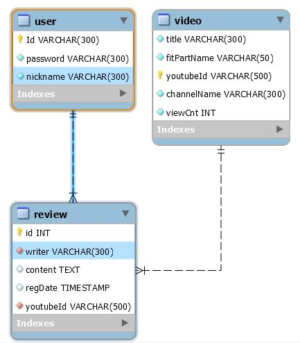

**Table 설계 SQL구문** 

**VIDEO TABLE** \
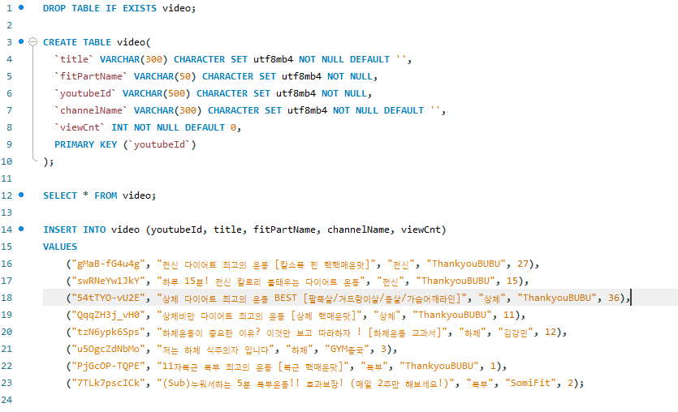 \
**REVIEW TABLE** \
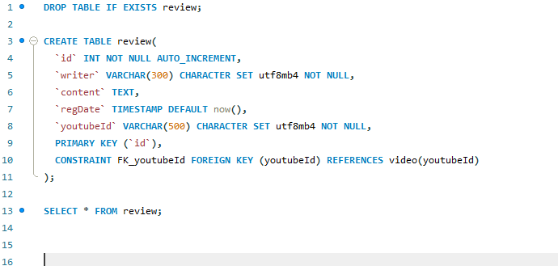 \
**USER TABLE** \
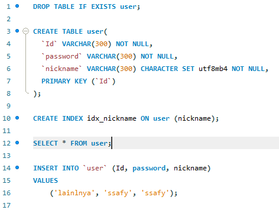 \


3. 데이터베이스와 JAVA Project를 연동한다.

---


---

✔ **폴더 구조**

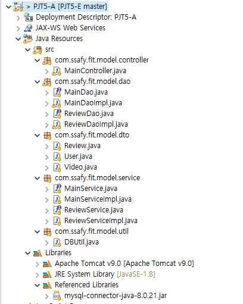
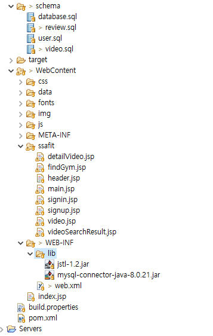

---

# 기본 기능 구현 화면

---

## 영상목록 화면

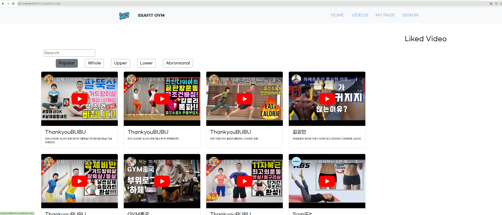
영상목록 페이지에서 popular 버튼을 누르면 DB에서 SELECT문을 이용하여 영상목록을 검색하고, 조회순 기준으로 정렬된 영상이 나온다.

**구현코드**

```java
@Override
	public List<Video> selectInterestViewFitVideo() {
		String sql = "SELECT * FROM video ORDER BY viewCnt DESC";
		List<Video> list = new ArrayList<>();

		Connection conn = null;
		Statement stmt = null;
		ResultSet rs = null;
		// 2. 데이터베이스 연결
		try {
			conn = util.getConnection();
			stmt = conn.createStatement();
			rs = stmt.executeQuery(sql);

			while (rs.next()) {
				Video video = new Video();
				video.setTitle(rs.getString(1));
				video.setFitPartName(rs.getString(2));
				video.setYoutubeId(rs.getString(3));
				video.setChannelName(rs.getString(4));
				video.setViewCnt(rs.getInt(5));

				list.add(video);
			}
		} catch (SQLException e) {
			e.printStackTrace();
		} finally {
			util.close(rs, stmt, conn);
		}
		
		
		return list;
			

	}

```


---

## 부위별 영상목록 출력 화면


**구현코드**

```java
//키워드로 검색했을 때 
	//비디오 리스트에서, 검색한 키워드를 갖고있는 비디오들만 찾아서 비디오 리스트로 반환
	@Override
	public List<Video> searchVideo(String keyword) {
		List<Video> searchList = new ArrayList<>();

		String sql = "SELECT * FROM video WHERE title LIKE ? ";
		
		Connection conn = null;
		PreparedStatement pstmt = null;
		ResultSet rs = null;
		// 2. 데이터베이스 연결
		try {
			conn = util.getConnection();
			pstmt = conn.prepareStatement(sql);
			pstmt.setString(1, '%'+keyword+'%');
			
			rs = pstmt.executeQuery();

			while (rs.next()) {
				Video video = new Video();
				video.setTitle(rs.getString(1));
				video.setFitPartName(rs.getString(2));
				video.setYoutubeId(rs.getString(3));
				video.setChannelName(rs.getString(4));
				video.setViewCnt(rs.getInt(5));

				searchList.add(video);
			}
		} catch (SQLException e) {
			e.printStackTrace();
		} finally {
			util.close(rs, pstmt, conn);
		}

		return searchList;
	}
```


---

## 영상검색 화면

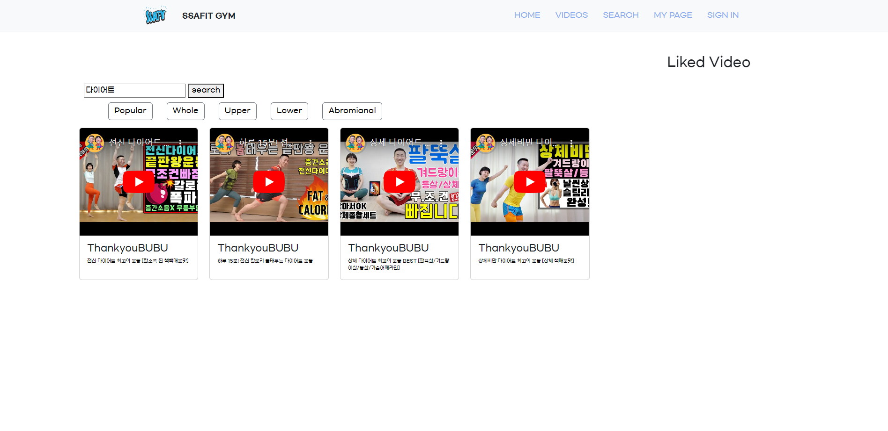
검색 시 DB에서 SELECT문을 이용하여 키워드를 포함하는 제목을 가진 영상목록을 검색하고, 영상목록을 출력한다.

**구현코드**

```java
//키워드로 검색했을 때 
	//비디오 리스트에서, 검색한 키워드를 갖고있는 비디오들만 찾아서 비디오 리스트로 반환
	@Override
	public List<Video> searchVideo(String keyword) {
		List<Video> searchList = new ArrayList<>();

		String sql = "SELECT * FROM video WHERE title LIKE ? ";
		
		Connection conn = null;
		PreparedStatement pstmt = null;
		ResultSet rs = null;
		// 2. 데이터베이스 연결
		try {
			conn = util.getConnection();
			pstmt = conn.prepareStatement(sql);
			pstmt.setString(1, '%'+keyword+'%');
			
			rs = pstmt.executeQuery();

			while (rs.next()) {
				Video video = new Video();
				video.setTitle(rs.getString(1));
				video.setFitPartName(rs.getString(2));
				video.setYoutubeId(rs.getString(3));
				video.setChannelName(rs.getString(4));
				video.setViewCnt(rs.getInt(5));

				searchList.add(video);
			}
		} catch (SQLException e) {
			e.printStackTrace();
		} finally {
			util.close(rs, pstmt, conn);
		}

		return searchList;
	}
```


## 영상상세 - 리뷰관리 화면

- 하단으로 쭉 내려 영상에 맞는 리뷰목록을 볼 수 있고, 리뷰등록/수정/삭제 리뷰를 관리할 수 있다.
- 리뷰 조회/등록/수정/삭제 시에 리뷰데이터들을 DB와 연동하여 CRUD가 가능하도록 코드를 연동시킨다.

**구현코드**

```java
@Override
	public List<Review> selectVideoReview(String youtubeId) {
		String sql = "SELECT * FROM review WHERE youtubeId = ?";
		List<Review> reviewList = new ArrayList<>();
		
		Connection conn = null;
		PreparedStatement pstmt = null;
		ResultSet rs = null;
		
		try {
			conn = util.getConnection();
			pstmt = conn.prepareStatement(sql);
			pstmt.setString(1, youtubeId);
			
			rs = pstmt.executeQuery();
			
			while (rs.next()) {
				Review review = new Review();
				
				review.setId(rs.getInt(1));
				review.setWriter(rs.getString(2));
				review.setContent(rs.getString(3));
				review.setRegDate(rs.getString(4));
				review.setYoutubeId(rs.getString(5));
				
				reviewList.add(review);
			}
			
		} catch (SQLException e) {
			e.printStackTrace();
		} finally {
			util.close(rs, pstmt, conn);
		}
		return reviewList;
	}
```


---

### 리뷰 등록 

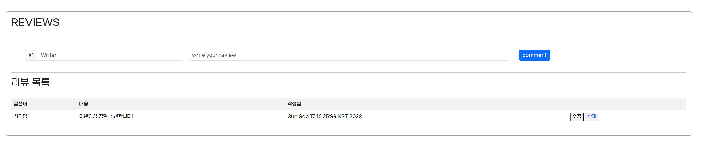

**구현코드**

```java
@Override
	public void registVideoReview(Review review) {
		String sql = "INSERT INTO review(writer, content, youtubeId) VALUES(?, ?, ?)";
		Connection conn = null;
		PreparedStatement pstmt = null;
		ResultSet rs = null;
		
		try {
			conn = util.getConnection();
			pstmt = conn.prepareStatement(sql);
			pstmt.setString(1, review.getWriter());
			pstmt.setString(2, review.getContent());
			pstmt.setString(3, review.getYoutubeId());
			
			pstmt.executeUpdate();
		} catch (SQLException e) {
			e.printStackTrace();
		} finally {
			util.close(rs, pstmt, conn);
		}
		
	}
```


---

### 리뷰 수정

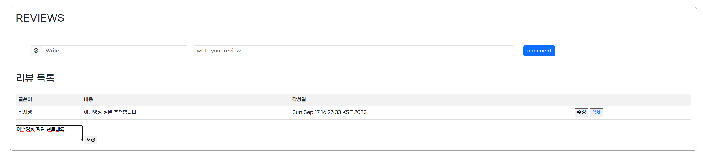


**구현코드**

```java
	@Override
	public void updateVideoReview(Review review) {
		String sql = "UPDATE review SET content = ? WHERE youtubeId = ?";
		Connection conn = null;
		PreparedStatement pstmt = null;
		ResultSet rs = null;
		
		try {
			conn = util.getConnection();
			pstmt = conn.prepareStatement(sql);
			
			pstmt.setString(1, review.getContent());
			pstmt.setString(2, review.getYoutubeId());
			
			pstmt.executeUpdate();
			
			
		} catch (SQLException e) {
			e.printStackTrace();
		} finally {
			util.close(rs, pstmt, conn);
		}

	}
```

### 리뷰 삭제 

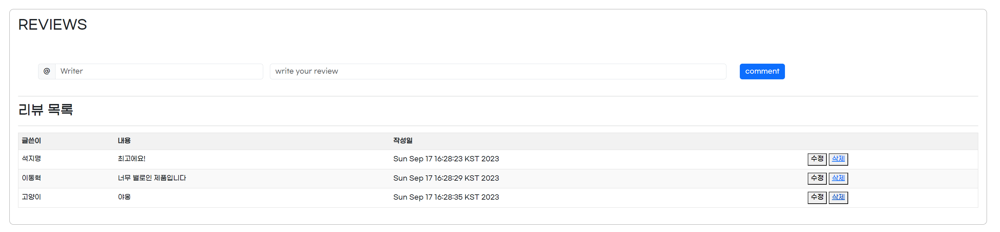


**구현코드**

```java
@Override
	public void deleteVideoReview(String youtubeId, int id) {
		String sql = "DELETE FROM review WHERE youtubeId = ? AND id = ?";
		Connection conn = null;
		PreparedStatement pstmt = null;
		
		try {
			conn = util.getConnection();
			pstmt = conn.prepareStatement(sql);
			
			pstmt.setString(1, youtubeId);
			pstmt.setInt(2, id);
			
			pstmt.executeUpdate();
			
			
		} catch (SQLException e) {
			e.printStackTrace();
		} finally {
			util.close(pstmt, conn);
		}
		
	}

```


---

# 추후 구현할 것

1. 사용자 팔로우 팔로워 기능 추가 및 DB연동
2. 영상찜기능 추가 및 DB연동
3. 로그인 기능 구현 및 회원정보 DB연동
4. 사용자와 리뷰 연결 및 DB연동
