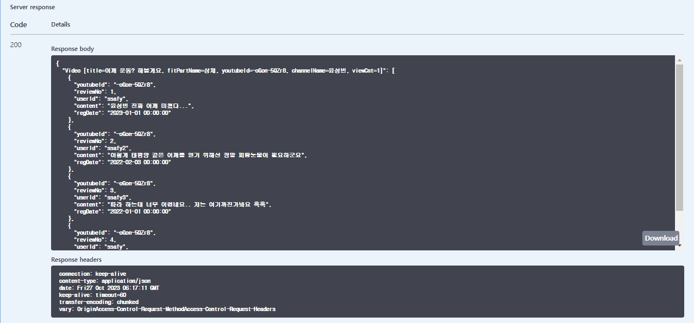
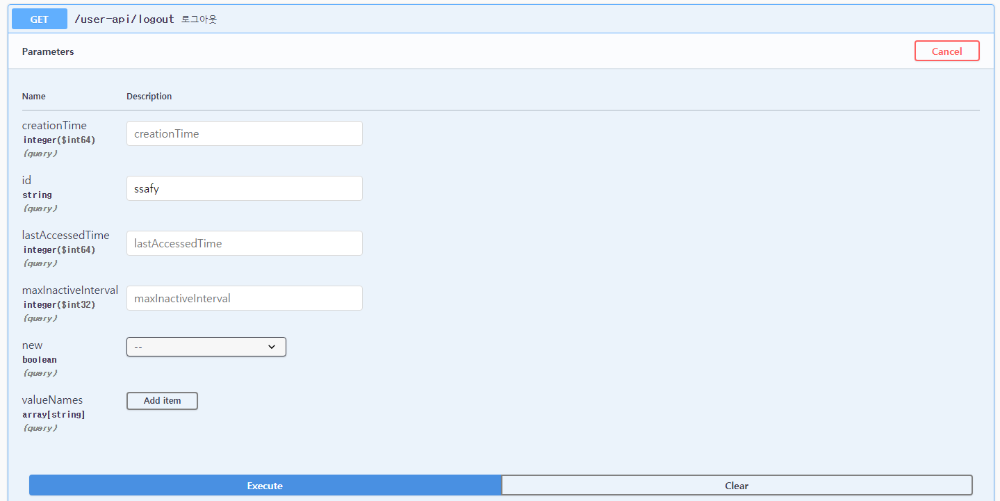
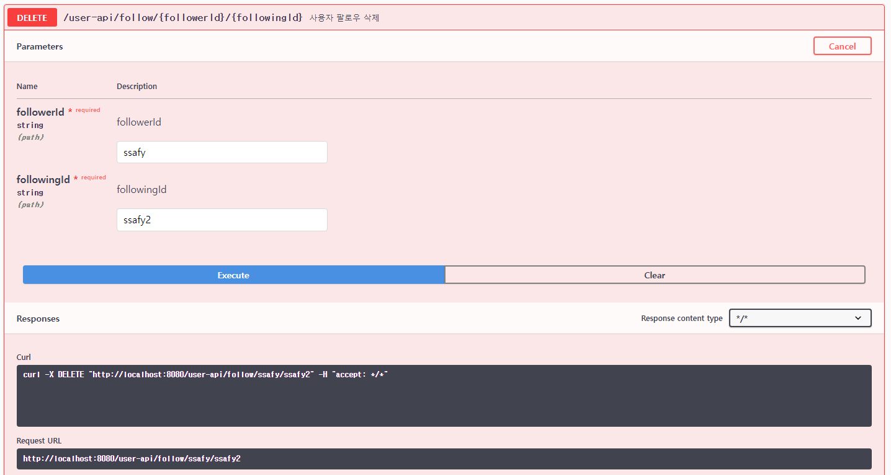

# PJT6-M
석지명 김남준

> 프로젝트 공통 README

## 🌟프로젝트 분류🌟

### SPRINBOOT REST API 관통 프로젝트 

<br/>
<br/>

## 👐 팀원 구성 및 역할 분담👐

<table align="center">
    <tr align="center">
        <td style="min-width: 220px;">
            <a href="https://github.com/heon118">
              
              <br />
              <b>석지명(팀장)</b>
            </a> 
        </td>
          <td style="min-width: 220px;">
            <a href="https://github.com/muyahoya">
              
                <br />
              <b>김남준</b>
            </a> 
        </td>
    </tr>
    <tr align="left">
        <td>
        0. 🙋 프로젝트 리더<br> 
        1. 백엔드 프로젝트와 DB 연결 <br>
        <br/>
        </td>
        <td>
        0. 🙋응애<br>
        1. 칭찬 <br>
        2. 매핑에러 디버깅 <br>
        <br/>
        </td>
    </tr>
</table>

<br/>
<br/>

## 프로젝트 정보

### 📌 요구사항

> ✅ : 구현 완료  ❌ : 미구현

#### 1️⃣ 기본기능 ✅

- 운동 영상 ✅
  - 운동 영상 요청 : 운동 영상 정보의 다양한 출력(조회수 많은 영상, 운동 부위별 영상) ✅
- 운동 영상에 대한 리뷰 관리 기능 ✅
  - 목록/등록/수정/상세/삭제 ✅
- 로그인/로그아웃/회원가입✅

#### 2️⃣ 추가기능 ✅

- 회원의 영상 찜 관리 기능 ✅
  - 목록, 등록, 삭제

#### 3️⃣ 심화기능
- 회원 팔로우 관리 기능 ✅
  - 팔로우 목록 / 등록 / 삭제 
- 메인 페이지 ❌
  - 팔로우한 회원들이 찜한 영상 조회 

### 📌 프로젝트 요약
- Ssafit 프로젝트의 BackEnd 파트를 Spring Framework을 활용하고 REST 기반의 웹프로젝트를 설계하고 구현

### 📌 프로젝트 목표
 - 웹 MVC 아키텍처를 이해하고 이를 활용하여 프로젝트에 적용할 수 있다.
 - Spring Framework를 이해하고 RESTful 방식으로 웹 서버를 구축 할 수 있다.
 - DB 연동은 MyBatis Framework를 활용하여 작성할 수 있다.

### ✔ 프로젝트 구조
📂 **<u>폴더 구조</u>**


<hr>

📂 **<u>E-R Diagram</u>**


<hr>

📂 **<u>Controller 매핑 구조</u>**

 <br>

 <br>

 <br>

<hr>

📂 **<u>Controller.java 코드</u>**

**VideoController**
```java
@RestController
@RequestMapping("/api")
@Api(tags="비디오 컨트롤러")
@CrossOrigin("*")
public class VideoController  {
	
	@Autowired
	private VideoService vService;
	
	@Autowired
	private UserService uService;
	
	@Autowired
	private ReviewService rService;
	
	//===============영상 R 구현===================
	
	@GetMapping("/list")
	@ApiOperation(value="영상 목록 조회")
	public ResponseEntity<?> list(){
		List<Video> list = vService.getList();
		if(list == null || list.size() == 0)
			return new ResponseEntity<Void>(HttpStatus.NO_CONTENT);
		return new ResponseEntity<List<Video>>(list, HttpStatus.OK);
	}
	
	@GetMapping("/latestList")
	@ApiOperation(value="최근 영상 목록 조회")
	public ResponseEntity<?> latestList(){
		List<Video> latestList = vService.getLatestList();
		if(latestList == null || latestList.size() == 0)
			return new ResponseEntity<Void>(HttpStatus.NO_CONTENT);
		return new ResponseEntity<List<Video>>(latestList, HttpStatus.OK);
	}
	
	@PostMapping("/searchVideo")
	@ApiOperation(value="비디오 검색")
	public ResponseEntity<?> searchVideo(@RequestBody SearchCondition sc){
		List<Video> searchList = vService.searchVideo(sc);
		if(searchList == null || searchList.size() == 0)
			return new ResponseEntity<Void>(HttpStatus.NO_CONTENT);
		return new ResponseEntity<List<Video>>(searchList, HttpStatus.OK);
	}
	
	@GetMapping("/{youtubeId}")
	@ApiOperation(value="비디오 상세보기")
	public ResponseEntity<?> detail(@PathVariable String youtubeId){
		Video video = vService.getVideo(youtubeId);
		if (video == null) {
			return new ResponseEntity<Void>(HttpStatus.NO_CONTENT);
		}
		return new ResponseEntity<Video>(video, HttpStatus.OK);
	}
	

}


```
<br>

**UserController**
```java
@RestController
@RequestMapping("/api-user")
@Api(tags="유저 컨트롤러")
@CrossOrigin("*")
public class UserController  {
	
	@Autowired
	private VideoService vService;
	
	@Autowired
	private UserService uService;
	
	@Autowired
	private ReviewService rService;

	//=======================유저파트 CURD 구현===========================
	@GetMapping("/{id}")
	@ApiOperation(value="유저 정보 조회")
	public ResponseEntity<?> list(@PathVariable String id){
		User user = uService.getUser(id);
		if (user == null) {
			return new ResponseEntity<Void>(HttpStatus.NO_CONTENT);			
		}
		return new ResponseEntity<User>(user, HttpStatus.OK);
	}
	
	@PostMapping("/signup")
	@ApiOperation(value="회원가입")
	public ResponseEntity<Void> signup(@RequestBody User user){
		int result = uService.createUser(user);
		//0이면 중복된 id가 존재한다는 것임
		//사실 중복id체크하는거 따로 만드는게 맞긴함
		if (result == 0) {
			return new ResponseEntity<Void>(HttpStatus.BAD_REQUEST);
		}
		return new ResponseEntity<Void>(HttpStatus.OK);
	}
	
	@PutMapping("/update")
	@ApiOperation(value="유저 정보 수정")
	public ResponseEntity<Void> update(@RequestBody User user){
		uService.modifyUser(user.getId(), user.getName());
		return new ResponseEntity<Void>(HttpStatus.OK);
	}

	// 유저 목록 가져오기
	@GetMapping("/users")
	@ApiOperation(value="유저 목록 조회")
	public ResponseEntity<List<User>> allUsers(){
		List<User> users = uService.getAllUser();
		return new ResponseEntity<List<User>>(users, HttpStatus.OK);
	}
	
	// 유저 팔로우 기능
	@PostMapping("/{followingId}/follow")
	@ApiOperation(value="유저 팔로우")
	//user는 현재 로그인 정보를 가져온다
	public ResponseEntity<Void> follow(@PathVariable String followingId, @RequestBody User user){
		uService.addFollow(user.getId(), followingId);
		return new ResponseEntity<Void>(HttpStatus.OK);
	}
	
	// 유저 팔로우 삭제
	@DeleteMapping("/deletefollowing")
	@ApiOperation(value="팔로잉 삭제")
	public ResponseEntity<Void> deletefollowing(@RequestParam String followingId, @RequestBody User user){
		uService.removeFollow(user.getId(), followingId);
		return new ResponseEntity<Void>(HttpStatus.OK);
	}
	
	// 팔로우하고 있는 유저 조회
	@GetMapping("/{userId}/followings")
	@ApiOperation(value="팔로잉하고 있는 유저들")
	public ResponseEntity<List<User>> allFollowings(@PathVariable String userId){
		List<User> followings = uService.getFollowingUser(userId);
		return new ResponseEntity<List<User>>(followings, HttpStatus.OK);
		
	}
	
	
	// 유저의 좋아요 영상 추가
	@PostMapping("/like/{youtubeId}")
	@ApiOperation(value="좋아요 영상 추가")
	public ResponseEntity<Void> likeVideo(@PathVariable String youtubeId, @RequestBody User user){
		uService.createUserVideo(user.getId(), youtubeId);
		return new ResponseEntity<Void>(HttpStatus.OK);
	}
	
	// 유저의 좋아요 영상 삭제
	@DeleteMapping("/delete/{youtubeId}")
	@ApiOperation(value="좋아요 영상 삭제")
	public ResponseEntity<Void> deleteLikedVideo(@PathVariable String youtubeId, @RequestBody User user){
		uService.removeUserVideo(user.getId(), youtubeId);
		return new ResponseEntity<Void>(HttpStatus.OK);
	}
	
	// 유저의 좋아요한 영상 조회
	@GetMapping("/{userId}/LikedVideo")
	@ApiOperation(value="좋아요 영상 조회")
	public ResponseEntity<List<Video>> LikedVideo(@PathVariable String userId){
		List<Video> likedVideoList = uService.getLikedVideo(userId);
		return new ResponseEntity<List<Video>>(likedVideoList, HttpStatus.OK);
	}
	
	//로그아웃 구현 지금은 안될듯... WebSecurity를 알아야함
	//회원탈퇴 구현안함

}


```
<br>

**ReviewController**
```java
@RestController
@RequestMapping("/api-review")
@Api(tags="리뷰 컨트롤러")
@CrossOrigin("*")
public class ReviewController  {
	
	@Autowired
	private VideoService vService;
	
	@Autowired
	private UserService uService;
	
	@Autowired
	private ReviewService rService;

	//=======================리뷰파트 CURD 구현===========================
	@GetMapping("/list/{youtubeId}")
	@ApiOperation(value="리뷰 조회")
	public ResponseEntity<List<Review>> list(@PathVariable String youtubeId){
		List<Review> reviewList = rService.getReview(youtubeId);
		return new ResponseEntity<List<Review>>(reviewList, HttpStatus.OK);
	}
	
	@PostMapping("/write")
	@ApiOperation(value="리뷰 작성")
	public ResponseEntity<Void> write(@RequestBody Review review){
		rService.writeReview(review);
		return new ResponseEntity<Void>(HttpStatus.OK);
	}
	
	@PutMapping("/update")
	@ApiOperation(value="리뷰 수정")
	public ResponseEntity<Void> update(@RequestBody Review review){
		rService.modifyReview(review.getVideoId(), review.getReviewNo(), review.getContent());
		return new ResponseEntity<Void>(HttpStatus.OK);
	}
	
	
	@DeleteMapping("/delete/{youtubeId}")
	@ApiOperation(value="리뷰 삭제")
	public ResponseEntity<Void> delete(@PathVariable String youtubeId, @RequestParam int reviewNo){
		rService.removeReview(youtubeId, reviewNo);
		return new ResponseEntity<Void>(HttpStatus.OK);
	}
	

}


```

<hr>

📂 **<u>Mapper.xml 코드</u>**

**VideoMapper**
```xml
<mapper namespace="com.ssafy.fit.model.dao.VideoDao">
	<select id="selectAll" resultType="Video">
		SELECT *
		FROM video;
	</select>
	
	<select id="selectLatestVideo" resultType="Video">
		SELECT *
		FROM video
		ORDER BY date DESC
		LIMIT 8;
	</select>
	
	<!-- 추후에 검색조건을 넣는 것으로 수정 -->
	<select id="searchVideo" resultType="Video" parameterType="SearchCondition">
		SELECT *
		FROM video
		WHERE fitPartName = #{searchCondition.fitPartName};
	</select>
	
	<insert id="insertVideo" parameterType="Video">
		INSERT INTO video (youtubeId, channelName, fitPartName, title, date, viewCnt)
		VALUES (#{youtubeId}, #{channelName}, #{fitPartName}, NOW(), 0);
		
	</insert>
	
	<select id="selectOne" resultType="Video" parameterType="String">
		SELECT *
		FROM video
		WHERE youtubeId = #{youtubeId};
	</select>
	
	<update id="updateVideo" parameterType="Video">
		UPDATE video
		SET fitPartName = #{fitPartName}, title = #{title}
		WHERE youtubeId = #{youtubeId};
	</update>
	
	<delete id="deleteVideo" parameterType="String">
		DELETE FROM video
		WHERE youtubeId = #{youtubeId};
	</delete>
	
	<update id="updateViewCnt" parameterType="String">
		UPDATE video
		SET viewCnt = viewCnt
		WHERE youtubeId = #{youtubeId};
	</update>
	

</mapper>

```
<br>

**UserMapper**
```xml
<mapper namespace="com.ssafy.fit.model.dao.UserDao">
	 <!-- 유저 생성 -->
    <insert id="insertUser" parameterType="User">
        INSERT INTO user (id, name)
        VALUES (#{id}, #{name});
        WHERE NOT EXISTS (SELECT * FROM user WHERE id = #{user.id});
    </insert>

    <!-- 유저 수정 -->
    <update id="updateUser">
        UPDATE user
        SET name = #{name}
        WHERE id = #{id};
    </update>

    <!-- 유저 삭제 -->
    <delete id="deleteUser">
        DELETE FROM user
        WHERE id = #{id};
    </delete>

    <!-- 유저 조회 -->
    <select id="selectOneUser" resultType="User">
        SELECT *
        FROM user
        WHERE id = #{userId};
    </select>


    <!-- 유저 목록 가져오기 -->
    <select id="selectAllUser" resultType="User">
        SELECT *
        FROM user;
    </select>

    <!-- 유저 팔로우 기능 -->
    <insert id="insertFollow">
        INSERT INTO follow (followerId, followingId)
        VALUES (#{followerId}, #{followingId})
    </insert>

    <!-- 유저 팔로우 삭제 -->
    <delete id="deleteFollow">
        DELETE FROM follow
        WHERE followerId = #{followerId} AND followingId = #{followingId}
    </delete>

    <!-- 팔로우하고 있는 유저 조회 -->
    <select id="selectFollowingUser" resultType="User" parameterType="String">
        SELECT u.id, u.pass, u.name
        FROM user u
        JOIN follow uf ON u.id = uf.followingId
        WHERE uf.followerId = #{followerId};
    </select>
    
     <!-- 유저의 좋아요한 영상 조회 -->
    <select id="selectUserVideo" resultType="Video">
        SELECT v.youtubeId, v.channelName, v.fitPartName, v.title, v.date, v.viewCnt
        FROM video v
        JOIN likedvideo lv ON v.youtubeId = lv.youtubeId
        WHERE lv.userId = #{userId};
    </select>

    <!-- 유저의 좋아요 영상 추가 -->
    <insert id="insertUserVideo">
        INSERT INTO likedvideo (userId, youtubeId)
        VALUES (#{userId}, #{youtubeId});
    </insert>

    <!-- 유저의 좋아요 영상 삭제 -->
    <delete id="deleteUserVideo">
        DELETE FROM likedvideo
        WHERE userId = #{userId} AND youtubeId = #{youtubeId};
    </delete>

</mapper>

```
<br>

**ReviewMapper**
```xml
<mapper namespace="com.ssafy.fit.model.dao.ReviewDao">
	
	<insert id="insertReview" parameterType="Review">
		INSERT INTO review (reviewNo, videoId, userId, content, regDate)
		VALUES
			(#{reviewNo}, #{videoId}, #{userId}, #{content}, NOW());
	</insert>
	
	<select id="selectReview" resultType="Review" parameterType="String">
		SELECT *
		FROM review
		WHERE videoId = #{videoId};
	</select>
	
	<select id="selectOneReview" resultType="Review">
		SELECT *
		FROM review
		WHERE videoId = #{videoId} AND reviewNo = #{reviewNo};
	</select>
	
	<update id="updateReview">
		UPDATE review
		SET content = #{content}
		WHERE videoId = #{videoId} AND reviewNo = #{reviewNo};
	</update>
	
	<delete id="deleteReview">
		DELETE FROM review
		WHERE videoId = #{videoId} AND reviewNo = #{reviewNo};
	</delete>
	

</mapper>

```

### ✔ 기본 기능 구현 확인

#### 1️⃣ 기본기능 ✅

- 운동 영상 ✅
  - 운동 영상 요청 : 운동 영상 정보의 다양한 출력(조회수 많은 영상, 운동 부위별 영상) ✅
- 운동 영상에 대한 리뷰 관리 기능 ✅
  - 목록/등록/수정/상세/삭제 ✅
- 로그인/로그아웃/회원가입✅

<br><br>

**<u>영상파트</u>**

#### - 영상 목록 조회


<br><br>


#### - 영상 등록


<br><br>


#### - 영상 수정


<br><br>

#### - 영상 삭제


<br><br>

#### - 영상 상세 조회



<br><br>

<hr>

**<u>리뷰파트</u>**

#### - 리뷰 작성


<br><br>

#### - 리뷰 수정


<br><br>

#### - 리뷰 삭제


<br><br>

#### - 리뷰 목록 조회


<br><br>

**<u>유저파트</u>**

#### 로그인


<br><br>

##### 로그인 성공


<br><br>

#### 로그아웃


<br><br>

#### 사용자 회원 가입


<br><br>

#### 사용자 목록 조회


<br><br>

#### 사용자 정보 수정


<hr>

### 2️⃣ 추가기능 ✅

- 회원의 영상 찜 관리 기능 ✅
  - 목록, 등록, 삭제

<br>

#### 사용자가 `좋아요`한 영상 조회


<br>

#### 사용자가 `좋아요`한 영상 추가


<br>

#### 사용자가 `좋아요`한 영상 삭제


<hr>

### 3️⃣ 심화기능

- 회원 팔로우 관리 기능 ✅
  - 팔로우 목록 / 등록 / 삭제 
- 메인 페이지 ❌
  - 팔로우한 회원들이 찜한 영상 조회 

<br>

#### 내 팔로워 조회


<br>

#### 사용자 팔로우


<br>

#### 사용자 팔로우 삭제



  